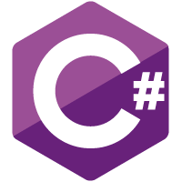
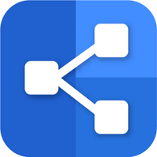

# Before the Pen

 Before the Pen is a CRUD web application, built with React, C#, and SQL, that keeps track of bullet journal layouts. Bullet Journaling is a highly customizable organizational system that encompasses the cross-section between journal, planner, to-do list, and sketchbook. Before the Pen provides a location to save bullet journal resources from across the web, plans which layouts are needed in the upcoming month, and provides data about which layouts were used in the past months.
  

## Table of Contents
  * [Project Requirements and Features List](#project-requirements-and-features-list)
  * [Technologies Used](#technologies-used)
  * [Installing and Launching Before the Pen](#instructions-for-installing-before-the-pen)
  * [Appendix 1: Planning Documentation](#appendix-1-planning-documentation)
    * [Entity Relationship Diagrams](#entity-relationship-diagram)
    * [Wireframes](#wireframes)
  * [Appendix 2: Set Up Instructions](#appendix-2-set-up-instructions)

## Project Requirements and Features List
### Get Started
When a user first registers/ logs into an account with Tender Tofu they will be presented with a form to select their friend from a drop down and a date for an eatery outign. By selecting the date and friend, the user is then presented with local vegetarian restuarant theat they can accept or pass on. The user contining to select until they have reached the end of the list.


### Friend's Turn
The friend that the user above has selected nnow opens the app and navigates to the Friend's Turn to Swipe page and selects the outing with the first user and the agreed upon date. Then the seconnd user is prompted with the same list as list user one. They also select Yummy or Pass as before. Through the use of short polling, once the friend/ second user has selected a restaurant in common a window alert with restaurant that both user like with appear in both user bowsers.  


## Technologies Used
  ### Development Languages and Libraries
  </img> </img> </img> </img> </img>

  ### Development Tools
  </img>    

## Instructions for Installing Before the Pen
  To launch the Before the Pen app, you will need to have access to command line tools, node package manager, JSON Server. If you do not have access to any of these tools, you can find instructions for installing them in the [Appendix.](#appendix-2-set-up-instructions)

### Requirements
* Git
* Visual Studio (configured to run server-side ASP.NET Web API C# code)
* MS SQL Server (Express or higher)
* NodeJS

### Firebase

You will need to create a Firebase project to have working authentication and authorization.

* Go to Firebase and create a project (can be named anything). Add authentication in the form of email/password to the project.
* In the project settings, you will need your `Project Id` and `Web API Key`

### Clone the project
 Clone this repo on you personal machine using the following terminal command
  ```sh
    git clone git@github.com:anna-moore/NSS-Back-EndCapstone-Before-the-Pen.git
  ```

### Back-end setup
* In `BeforeThePen/appsettings.json` change the `FirebaseProjectId` value to your Firebase `Project Id`
* From `BeforeThePen/SQL`, run the scripts `01_Db_Create.sql` and then `02_Seed_Data.sql` to generate the database
* To use the default test account `test@example.com`, create a user account in your Firebase project's auth section with that email address (and any password) and replace the data in that user's `FirebaseUserId` column in the database with the id generated in your Firebase project
* Load `BeforeThePen.sln` in Visual Studio and hit F5 to run the server (after ensuring that FlashcardFight is selected instead of the default IIS Express server)

### Front-end Setup
* Create a file in `BeforeThePen/client/` called `.env.local`
* In this file, paste `REACT_APP_API_KEY=Web API Key`, replacing "Web API Key" with your unique key from your Firebase project's project settings
* Run `npm install` in `BeforeThePen/client` to install all dependencies
* To start the development server on `localhost:3000`, run `npm start`
* A browser window should open with the authentication page and you can enter `test@example.com` as your email address with the password you added in Firebase


 ### Congratulations you are now experiencing Before the Pen!

  ## Appendix 1: Planning Documentation

  ### Entity Relationship Diagram
  

  ### Wireframes
  </img> 
  </img> 
  </img> 
  </img> 
  </img> 
  


  ## Appendix 2: Set Up Instructions
 
  You will need to have command line tools installed for your computer to use terminal commands.

  Linux/ Windows users, please visit the [Git page](https://git-scm.com/book/en/v2/Getting-Started-Installing-Git) and follow the instructions for set up

  Mac users follow the instructions below

  Open your terminal and type
  ```sh
    git --version
  ```

  You will now need to configure your git account. In the terminal window, type:
  ```sh
    git config -global user.name "Your Name"
    git config -global user.email "Your Email"
  ```

  If you do not have Node.js installed on your machine, visit the [Node.js Download Page](https://nodejs.org/en/download/) and  follow the instructions. To ensure that it is installed correctly, in your terminal window, type
  ```sh
    echo $PATH
  ```
  Ensure that the result has the following in the $PATH
  ```sh
    /usr/local/bin
    or
    /usr/local/bin:/usr/bin:/bin:/usr/sbin:/sbin
  ```

Add instructions for creating a firebase account.
Add instructions for downloading visual studio.

  Now you can follow the [installation instructions](#instructions-for-installing-before-the-Pen) to get Before the Pen up and running on your machine.

  This project was bootstrapped with [Create React App](https://github.com/facebook/create-react-app).
